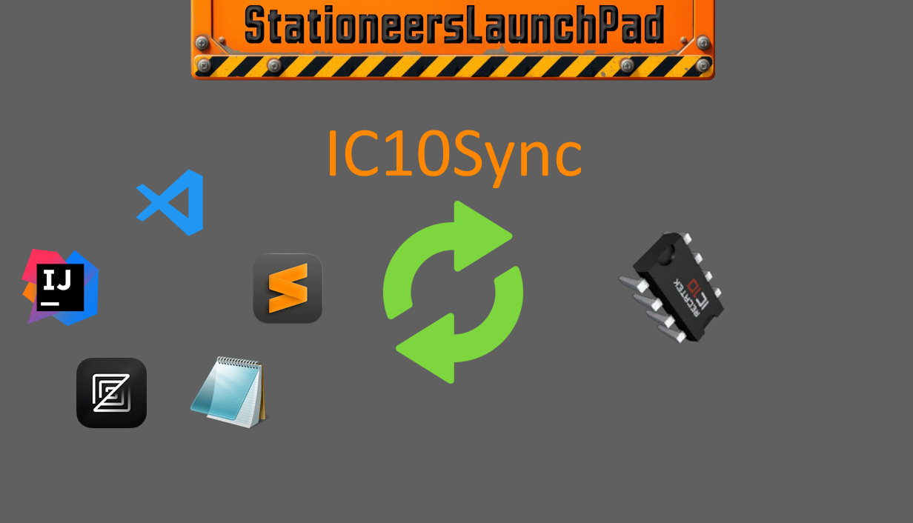

# Mod for Stationeers game, that allows editing IC10 directly from your favorite text editor
**Mod page in Steam workshop**

Depends on [StationeersLaunchPad](https://github.com/StationeersLaunchPad/StationeersLaunchPad)

See mod description in [About.xml](./About/About.xml)

Based on https://github.com/ilodev/ExampleMod

## Building:
When you build the project, all the files are automatically copied to the Stationeers local mod folder.
Keep this project outside of the mods folder. 

When you want to publish your mod make sure you:
- Update the About.xml with the necessary information. 
- Keep the warnings in the description fields in About.xml. One description is for steam, the other ingame. This allows for separate markup on the steam workshop and ingame.
- After publish check About.xml in the local mods folder. It will have a workshophandle added. Copy this tag to the About.xml file in this project! It allows you to safely update your mod. 
  ALL THE FILES IN THE LOCAL MOD FOLDER GET OVERWRITTEN EACH TIME YOU BUILD

The stationeersmods file is an empty marker file, so StationeersMods knows it should load this mod.
The .info file is also used by StationeersMods to load in your mod.

The bare minimum your built mod should contain is:
Mod
- About
  - About.xml
  - Preview.png
  - stationeersmods
  - thumb.png
- GameData
  - dont.remove (of course you can remove this file if you add custom language or recipes to this folder)
- Mod.dll
- Mod.info

There is a release and a debug build. The debug build includes a PDB file for debugging purposes.

